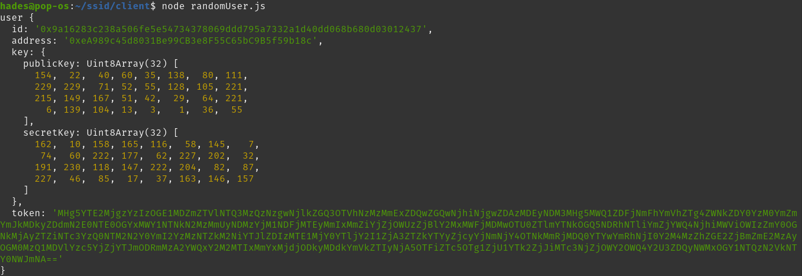
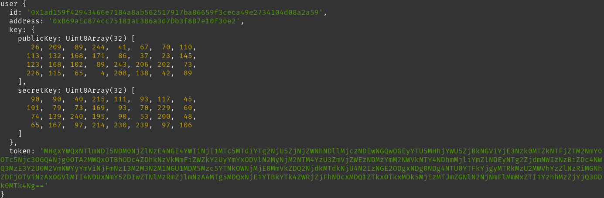

# certificates/ssid demo for self-sovereign identity and its certificates.

## Prerequisite
node version 12 or above.

### Deployment Steps
- **npm install**
- **npx truffle compile** compiles the smart contracts.
- **npx ganache-cli -i 17 -m "ssid e2tech credentials corona-testing compliance degov bp"** executes the EVM.
- **node deploy.js** deploys smart contracts on the EVM.
- **npx nodemon app.js** triggers the server (port 3000 should be free or the port can be modified under _app.js_)

### User/Token Generation
In order to authenticate the web request a user is required to create an Authentication Token and send it along the request as the Bearer Token header. This Authentication Token serves as the proof of identity or in other terms proof of ownership of the private key.

The token can be generated by executing **node client/randomUser.js**, this will generate a random user on each execution, however, executing **node client/generateAuthenticationToken.js** will always return same user token and an administrator token.

### API End Points ([Postman Collection](docs/ssid.postman_collection.json))
The attached postman collection contains request to exposed end-points;

- POST /user/signup - Registers a User, it's payload includes; {"property": string} any human readable value and a Bearer Authentication Token is also required. A hash value of the property is stored in the Smart Contract.

- GET /user/is?property={property} - Returns the status of the user identified by the property.

- GET /user/id?property={property} - Returns the public key of the user identified by the property.

- POST /certificate/issue - Issues a certificate to a user (Ethereum Address) and should be executed by an administrator. The Bearer Token provided should be of an administrator. This can be generated using **node client/generateAuthenticationToken.js**. The payload includes {"address": [ethereum address of the user], "number": integer[certificate number]}.

- POST /certificate/revoke - Revokes a certificate to a user (Ethereum Address) and should be executed by an administrator. The Bearer Token provided should be of an administrator. This can be generated using **node client/generateAuthenticationToken.js**. The payload includes {"address": [ethereum address of the user], "number": integer[certificate number]}.

- GET /certificate/has?address={user's address}&number={certificate number} - Verifies if a user (identified by address) has a particular certificate.

- POST /authentication/request/validate - Authenticates a authentication request identified by a token presented as QR Code. It's payload includes;
{"token": string, "property": string"} and authentication token in request headers.

### Authentication Request Validation Flow
User connects to a service that requires proof of identity (authentication). The service presents a QR Code that holds a authentication request token, that user can verify by scanning the QR Code and signing the authentication request. The signature is to posted to the URL /authentication/request/validate.

When executed, _(node client/client.js)_ the client script connects to the server over websockets, on connection the client receives an authentication request token from the server.

The value of the token when sent to POST /authentication/request/valiate further validates the token, to provide access to a service.

P.S. The documentation for the API is really pathetic I will try to post swagger documentation.